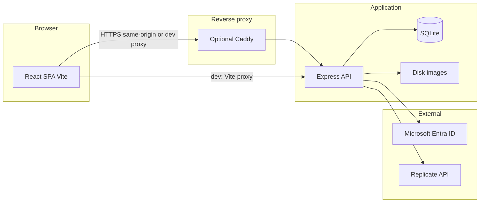

# LABA AI Studio — Technical Documentation

This document describes architecture, APIs, data model, configuration, and operations for the LABA AI Studio codebase.

---

## 1. Purpose

Web application for LABA academy students to:

- Authenticate with **Microsoft Entra ID** (institutional accounts).
- Generate images via **Replicate** (FLUX.1 Schnell / Dev, **Real-ESRGAN** upscale).
- Enforce **per-user monthly quotas** server-side (admins bypass quotas).
- Provide an **admin UI** for users, quotas, and basic stats.

---

## 2. High-level architecture



**Typical production path:** Browser → Caddy (TLS, routing) → static frontend (nginx in Docker) + API backend on internal port.  
**Local development:** `frontend` Vite dev server proxies `/api`, `/auth`, `/media` to `backend` on `127.0.0.1:3001`.

---

## 3. Technology stack

| Layer | Technology |
|--------|-------------|
| **Frontend** | React 18, Vite 6, TailwindCSS 3 |
| **Backend** | Node.js 20+, Express 4, ESM (`"type": "module"`) |
| **Database** | SQLite via `better-sqlite3` (synchronous, WAL) |
| **Sessions** | `express-session` + `connect-sqlite3` (persistent store) |
| **Auth** | `@azure/msal-node` (OAuth 2.0 authorization code flow) |
| **Image generation** | `replicate` npm package → FLUX / Real-ESRGAN |
| **Security** | `helmet`, CORS (allowlist), `express-rate-limit` on generate/upscale |

---

## 4. Repository layout

```
.
├── backend/
│   ├── Dockerfile
│   ├── package.json
│   └── src/
│       ├── index.js              # Express app, middleware, mounts, media routes
│       ├── auth/microsoft.js     # OAuth routes: login, callback, logout, me
│       ├── db/
│       │   ├── schema.sql        # SQLite DDL
│       │   └── client.js         # DB init + optional migrations
│       ├── middleware/           # auth, quota, rateLimit
│       ├── routes/               # generate, jobs, upscale, quota, admin
│       ├── services/             # replicate, quota, imageStorage
│       └── util/                 # sanitize
├── frontend/
│   ├── Dockerfile
│   ├── nginx.conf                # SPA fallback for production image
│   ├── vite.config.js            # dev proxy to backend
│   └── src/
│       ├── App.jsx
│       ├── components/
│       ├── hooks/                # useAuth, useGenerate, useQuota
│       └── lib/api.js            # fetch with credentials
├── caddy/
│   └── Caddyfile                 # routes /api, /auth, /media → backend
├── docker-compose.yml
├── .env.example
├── README.md
├── LABA-AI-implementation-plan.md
└── docs/
    └── TECHNICAL.md              # this file
```

---

## 5. Backend

### 5.1 Entry point (`backend/src/index.js`)

- Loads environment via `dotenv` (expects `.env` in cwd when running `node`).
- Initializes SQLite app DB (`db()`).
- **Trust proxy:** `1` (behind Caddy/nginx).
- **CORS:** Allowlist `FRONTEND_URL` + `http://localhost:5173` + `http://127.0.0.1:5173`; `credentials: true` for cookies.
- **Session:** Cookie name `laba.sid`, `httpOnly`, `sameSite: lax`, `maxAge` 8h.  
  `secure` is `true` in production unless `COOKIE_SECURE=false`.
- **Routes mounted:**
  - `GET /api/health` — liveness JSON `{ ok: true }`.
  - `/auth` — Microsoft OAuth (see §6).
  - `/api/generate`, `/api/jobs`, `/api/upscale`, `/api/quota`, `/api/admin`.
  - `GET /media/public/:token` — **unauthenticated** file serving for Replicate fetch (public token).
  - `GET /media/:jobId` — **authenticated**; user must own the job.

### 5.2 Authentication & authorization

| Middleware | Role |
|------------|------|
| `requireAuth` | Session must contain `userId`; else `401`. |
| `requireAdmin` | `role === 'admin'`; else `403`. |

**Bootstrap admins:** `BOOTSTRAP_ADMIN_EMAILS` (comma-separated) promotes matching emails to `admin` on login.

### 5.3 HTTP API reference

Base path: **no** `/api` prefix on `/auth` or `/media`. API routes under `/api/*`.

| Method | Path | Auth | Description |
|--------|------|------|-------------|
| `GET` | `/api/health` | No | Health check. |
| `GET` | `/auth/login` | No | Redirect to Microsoft login (503 if Azure not configured). |
| `GET` | `/auth/callback` | No | OAuth code exchange, session creation, redirect to `FRONTEND_URL`. |
| `GET` | `/auth/logout` | Session | Destroy session, redirect to frontend. |
| `GET` | `/auth/me` | Session | `{ user: null }` or `{ user: { id, email, displayName, role } }`. |
| `POST` | `/api/generate` | Yes | Start image job; body: `prompt`, `negative_prompt`, `model` (`schnell`\|`dev`), `aspect_ratio`, `style`, `chaos`, `stylize`. Rate-limited. |
| `GET` | `/api/jobs/:jobId` | Yes | Poll Replicate + DB; finalize success, download image, increment quota. |
| `POST` | `/api/upscale` | Yes | Body: `{ jobId }` — source must be user’s succeeded job; rate-limited. |
| `GET` | `/api/quota/me` | Yes | quota status; admins get `unlimited: true`. |
| `GET` | `/api/admin/users` | Admin | List users + quota usage. |
| `PUT` | `/api/admin/users/:id/quota` | Admin | Body: `standard_monthly`, `hires_monthly`. |
| `PUT` | `/api/admin/users/:id/role` | Admin | Body: `role` (`student` \| `admin`). |
| `POST` | `/api/admin/users/:id/reset` | Admin | Reset current month usage for user. |
| `GET` | `/api/admin/stats` | Admin | Aggregate stats. |
| `GET` | `/media/:jobId` | Yes | Serve image file for owned job. |
| `GET` | `/media/public/:token` | No | Serve by `media_access_token` (for Replicate upscale). |

**Common error codes (JSON `error` field):** `unauthorized`, `forbidden`, `quota_exceeded`, `rate_limited`, `invalid_model`, etc.

### 5.4 Quota logic

- **Models:** `schnell` (Relax) uses **standard** monthly pool; `dev` (Fast) uses **hires** pool; **upscale** consumes **standard** pool (same as implementation plan).
- **Checks:** Middleware runs **before** job creation; **increment** only on successful completion (in `GET /api/jobs/:jobId` when transitioning to succeeded).
- **Admins:** Skip quota checks and increments.
- **Month key:** `YYYY-MM` in `quota_usage`.

### 5.5 Replicate integration (`services/replicate.js`)

- **Models:** `black-forest-labs/flux-schnell`, `black-forest-labs/flux-dev`, Real-ESRGAN (upscale).
- **Predictions:** `replicate.predictions.create({ model, input })` and `get(id)` for polling.
- **Prompt:** Sanitized (strip HTML, max length) in `util/sanitize.js`.

### 5.6 Image storage

- Successful outputs are **downloaded** from Replicate to `IMAGES_DIR` (default `data/images` or `/data/images` in Docker).
- `usage_log.remote` Replicate URL kept for reference; UI receives **relative** `/media/:jobId` after success.
- **`media_access_token`:** Random hex on success; used for `GET /media/public/:token` so Replicate can fetch when **upscaling** if the original Replicate URL is gone (requires `PUBLIC_BASE_URL` / `FRONTEND_URL` pointing to the same origin Caddy exposes).

### 5.7 Rate limiting

- `express-rate-limit` on `/api/generate` and `/api/upscale` (same preset: **10 requests / minute / IP** per route mount).

---

## 6. Microsoft OAuth flow

1. User opens SPA → `GET /auth/me` (cookie or `401`).
2. User clicks login → browser navigates to `GET /auth/login` → redirect to Microsoft.
3. Microsoft redirects to **`OAUTH_REDIRECT_URI`** if set, else **`{FRONTEND_URL}/auth/callback`** (must match Azure app registration).
4. Backend exchanges code, upserts `users`, ensures `quota_config`, sets session, redirects to **`FRONTEND_URL`**.

**Azure app registration:**  
- Redirect URI(s): e.g. `https://your-domain/auth/callback` or `http://localhost:5173/auth/callback`.  
- Scopes used: `openid`, `profile`, `email`, `User.Read`.  
- Single-tenant recommended (`AZURE_TENANT_ID`).

---

## 7. Database schema (SQLite)

See `backend/src/db/schema.sql`. Core tables:

| Table | Purpose |
|-------|---------|
| `users` | Microsoft `microsoft_id`, email, `role`, timestamps. |
| `quota_config` | Per-user `standard_monthly`, `hires_monthly`, `reset_day`. |
| `usage_log` | One row per job: `job_id` (Replicate prediction id), `model`, `prompt`, `params` JSON, `status`, `image_url`, `local_path`, `media_access_token`, `cost_credits`. |
| `quota_usage` | Per user per month: `standard_used`, `hires_used`. |

`client.js` runs `schema.sql` on startup and **best-effort** `ALTER TABLE` for new columns on existing DBs.

---

## 8. Frontend

### 8.1 Development

- `npm run dev` — Vite default port **5173** (see `vite.config.js`).
- Proxy: `/api` → `http://127.0.0.1:3001`, same for `/auth` and `/media`.

### 8.2 Production build

- `npm run build` → `frontend/dist/`.
- Docker image serves **nginx** with `try_files` SPA fallback (`nginx.conf`).

### 8.3 API usage

- `lib/api.js` uses `fetch` with **`credentials: 'include'`** for session cookies.
- All paths are **relative** (`/auth/me`, `/api/...`) so the same origin works behind Caddy.

---

## 9. Environment variables

| Variable | Required | Description |
|----------|----------|-------------|
| `REPLICATE_API_TOKEN` | Yes (generation) | Replicate API token. |
| `AZURE_CLIENT_ID` | Yes (login) | App registration client ID. |
| `AZURE_TENANT_ID` | Yes (login) | Directory tenant ID. |
| `AZURE_CLIENT_SECRET` | Yes (login) | Confidential client secret. |
| `SESSION_SECRET` | Production | Secret for signing session cookie. |
| `FRONTEND_URL` | Yes | Public origin of SPA (e.g. `https://ai.laba.edu` or `http://localhost:5173`). Used for OAuth redirect and CORS. |
| `OAUTH_REDIRECT_URI` | Optional | Override redirect URI (must match Azure). |
| `PUBLIC_BASE_URL` | Upscale | Same as user-facing origin; used to build URLs for Replicate to fetch `/media/public/:token`. |
| `PORT` | Optional | Backend port (default `3001`). |
| `NODE_ENV` | Optional | `production` enables secure cookies. |
| `DATABASE_PATH` | Optional | SQLite DB file path. |
| `SESSION_DB_PATH` | Optional | SQLite session store file. |
| `IMAGES_DIR` | Optional | Downloaded images directory. |
| `BOOTSTRAP_ADMIN_EMAILS` | Optional | Comma-separated emails → `admin` on login. |
| `COOKIE_SECURE` | Optional | Set `false` for HTTP-only local dev behind no TLS. |

**Frontend build (Docker):** `VITE_API_URL` is optional; if empty, relative URLs are used.

---

## 10. Docker Compose

Services (see `docker-compose.yml`):

- **caddy** — Reverse proxy; `caddy/Caddyfile` routes `/api/*`, `/auth/*`, `/media/*` → backend, else → frontend.
- **backend** — Build `backend/Dockerfile`, volume `backend_data:/data` for DB + images + sessions.
- **frontend** — Build `frontend/Dockerfile` (static nginx).

Pass env via `.env` in project root (Compose interpolates `${VAR}`).

---

## 11. Security considerations

- Session cookies are **not** readable by JS (`httpOnly`).
- **CORS** is restricted to configured origins; credentials enabled only for those origins.
- **Prompt** length and HTML stripping reduce injection risk.
- **Replicate token** is server-only.
- **Media:** Authenticated route for users; public token route only for known opaque tokens (upscale integration).
- **Admin** routes require `role === 'admin'`.

---

## 12. Operations

| Task | Action |
|------|--------|
| Health | `GET /api/health` |
| Backup | Copy SQLite files (`DATABASE_PATH`, `SESSION_DB_PATH`) and `IMAGES_DIR` |
| Logs | Container stdout / `docker compose logs` |
| Upgrade | Rebuild images; run DB migrations if schema changes (add ALTERs in `client.js` or manual SQL) |

---

## 13. Related documents

- `README.md` — quick start and commands.
- `LABA-AI-implementation-plan.md` — original product specification and design notes.

---

*Document version: 1.0 — matches codebase layout as of project snapshot.*
